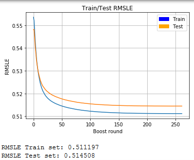
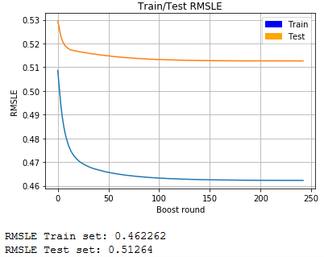
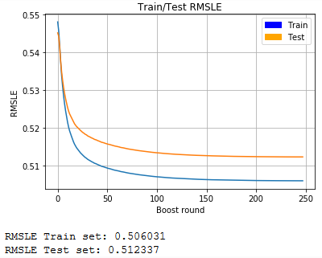
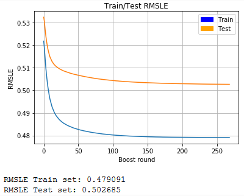
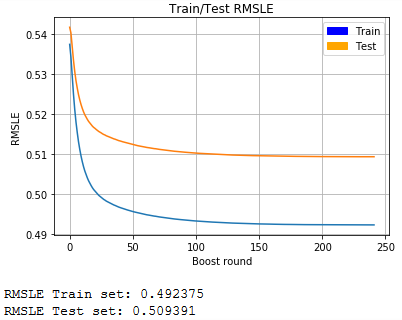
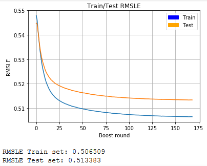
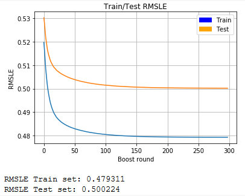
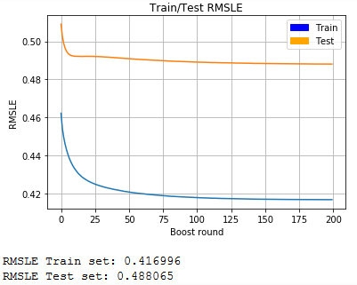
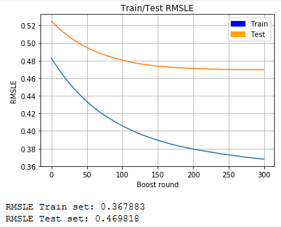

# __HEALTH HERITAGE PRIZE REPORT__

- [__HEALTH HERITAGE PRIZE REPORT__](#health-heritage-prize-report)
  - [__1. Author__](#1-author)
  - [__2. Project Description__](#2-project-description)
  - [__3. Model Selection__](#3-model-selection)
  - [__4. Data Extraction__](#4-data-extraction)
    - [_4.1. Detail Data Description_](#41-detail-data-description)
      - [4.1.1. Members Information](#411-members-information)
      - [4.1.2. Claims Information](#412-claims-information)
      - [4.1.3. DrugCount and LabCount Information](#413-drugcount-and-labcount-information)
      - [4.1.4. Days in Hospital](#414-days-in-hospital)
    - [_4.2. Result_](#42-result)
  - [__5. Features selection__](#5-features-selection)
    - [_1.A. Linear No Drop_](#1a-linear-no-drop)
    - [_1.B. Tree No Drop_](#1b-tree-no-drop)
    - [_2.A. Linear Drop PayDelay_](#2a-linear-drop-paydelay)
    - [_2.B. Tree Drop PayDelay_](#2b-tree-drop-paydelay)
    - [_3.A. Linear Drop Claims Count_](#3a-linear-drop-claims-count)
    - [_3.B. Tree Drop Claims Count_](#3b-tree-drop-claims-count)
    - [_4.A. Linear Drop Drug Count_](#4a-linear-drop-drug-count)
    - [_4.B. Tree Drop Drug Count_](#4b-tree-drop-drug-count)
    - [_5.A. Linear Drop Lab Count_](#5a-linear-drop-lab-count)
    - [_5.B. Tree Drop Lab Count_](#5b-tree-drop-lab-count)
    - [_6.A. Linear Drop SupLOS_](#6a-linear-drop-suplos)
    - [_6.B. Tree Drop SupLOS_](#6b-tree-drop-suplos)
    - [_7.A. Linear Drop Claims_](#7a-linear-drop-claims)
    - [_7.B. Tree Drop Claims_](#7b-tree-drop-claims)
    - [_8.A. Linear Drop All Scenario_](#8a-linear-drop-all-scenario)
    - [_8.B. Tree Drop All Scenario_](#8b-tree-drop-all-scenario)
  - [__6. Model Parameter Tunning__](#6-model-parameter-tunning)
  - [__7. Result__](#7-result)
  - [__8. Conclusion__](#8-conclusion)
    - [_8.1. Lessons Learnt_](#81-lessons-learnt)
    - [_8.2. Potential Improvement_](#82-potential-improvement)
  - [__Reference__](#reference)

## __1. Author__

This project is part of VEF Academy Machine Learning Course of Winter 2018 and all done by __Nguyen Thai Nam__, Group 13.

## __2. Project Description__

Health Heritage Prize (HHP) is a Kaggle challenge held in 2012 with the best score is 0.466 Root mean square logarithmic error (RMSLE). The HHP dataset is included 3 years claims of insurance payment record in US hospital with several patient health information categories. HHP challenge purpose is predicting days a patient will spend in the hospital in the next year base on claims data of the year before.

In this project, dataset is used from HHP dataset release 3, include 3 years claims, Days in hospital of year 2, 3, patient personal information, Drug count and Lab count of claims.

This project has 2 problems:

- Using dataset in claims level and prediction in patient (MemberID) level.
- Predict result is continuous numeric.

With these problems, the ideal to solve will follow these step:

1. __Data extraction:__ Extract and convert feature in claims level to member level for prediction.
2. __Feature selection:__ Select features for using in prediction model
3. __Tune & Train model:__ With features selected from previous step, choose model hyper-parameter, train and get the model result
4. __Compare Result:__ Compare the result with other model results, then repeat from Step 1, 2 or 3 to improve the result.

## __3. Model Selection__

As describe in section 2, predict results is continuous numeric so the problem can be solved with Linear Regression and/or Decision Tree gradient booster.

The widely used state-of-the-art solution for a similar problem is XGBoost and have been proved outperforms other solutions.

## __4. Data Extraction__

### _4.1. Detail Data Description_

The dataset using include:

1. Members.csv
2. Claims.csv
3. DrugCount.csv
4. LabCount.csv
5. DaysInHospital_Y2.csv
6. DaysInHospital_Y3.csv

#### 4.1.1. Members Information

Members information have 2 feature columns:

- Sex with Male, Female and Null value. All will be binary One-Hot coded for each MemberID.
- Age at first claim with categories value type from '0-9' age range to '69-79' age and '80+' age. These values will be converted to integer mean average, for example, '10-19' will be replaced with 15.

#### 4.1.2. Claims Information

Claims table is claims level information with features:

- MemberID: Patient ID
- ProviderID: Claims provider ID
- Vendor: Claims vendor ID
- PCP: Claims PCP ID
- Year: Y1, Y2 or Y3
- Specialty: Categorical data of Specialty
- PlaceSvc: Categorical data of service place
- PayDelay: Number in range 0-161 with 95% percentile top-coded as string "162+"
- LengthOfSay: Categorical data of day length up to 6 days and weeks length range up to 8 weeks. If above that length, Suppression is applied and value at SupLOS column is 1, else 0
- DSFS: Categorical data of number of month, range from 1 to 12.
- PrimaryConditionGroup: Categorical data of diagnostic
- CharlsonIndex: Categorical data of CharlsonIndex
- ProcedureGroup: Categorical data of procedures
- SupLOS: 0 and 1 for none suppression  and suppressed in Length of Stay values, respectively.

This processing step will only use Y1 data for training and Y2 for testing. Each will convert features from claims level to member level following rules:

- ID data like Provider, Vendor and PCP will only sum the unique ID values of each MemberID.
- Numeric data like PayDelay will convert to integer and sum for each MemberID.
- Other Categorical data will One-Hot with value_counts based on MemberID.

Each feature will be converted and save to separated csv file.

Count Unique ID

- Provider
- Vendor
- PCP

One-Hot with value_counts for categorical features.

- Specialty
- PlaceSvc
- PrimaryConditionGroup
- CharlsonIndex
- ProcedureGroup
- DSFS
- LengthOfStay with SupLOS

Summing values with

- PayDelay
- Number of member's claims

#### 4.1.3. DrugCount and LabCount Information

- DrugCount is count of unique prescription drugs filled and top-coded at 7
- LabCount is count of unique laboratory and pathology tests and top-coded at 10

Both are numeric data and will be converted to integer and sum for each MemberID in each Year.

#### 4.1.4. Days in Hospital

This is the model label for training model. ClaimsTruncated features are dropped and sorted base on MemberID and save to csv files.

### _4.2. Result_

Data is converted from Claim level in categories and numeric type to Member level with one-hot and summing type (for columns with large numeric value). Each column in Claims will convert and save to csv file for later use, due to long time processing.

Output dataset include:

- MemberInfo_df.csv
- DaysInHos_Y2.csv
- DaysInHos_Y3.csv
- Claims_count_Y1.csv
- Claims_count_Y2.csv
- Charlson_Y1.csv
- Charlson_Y2.csv
- DrugCount_Y1.csv
- DrugCount_Y2.csv
- DSFS_Y1.csv
- DSFS_Y2.csv
- LabCount_Y1.csv
- LabCount_Y2.csv
- LOS_Y1.csv
- LOS_Y2.csv
- PayDelay_Y1.csv
- PayDelay_Y2.csv
- PCPs_Y1.csv
- PCPs_Y2.csv
- PlaceSvc_Y1.csv
- PlaceSvc_Y2.csv
- PrimCondition_Y1.csv
- PrimCondition_Y2.csv
- Procedures_Y1.csv
- Procedures_Y2.csv
- Providers_Y1.csv
- Providers_Y2.csv
- Specialty_Y1.csv
- Specialty_Y2.csv
- Vendors_Y1.csv
- Vendors_Y2.csv

The extraction is using code in [Data_Prep.ipynb](Data_Prep_1.ipynb) notebook, import input csv file and export the converted data to csv file for future features selection and tunning model.

## __5. Features selection__

HHP dataset has strictly de-identification processing that meets the requirements of the Health Insurance Portability and Accountability Act Privacy Rule that could make some noise in the data that affect the prediction result. In the [Data extraction](#4-data-extraction) step, there are 6 features that have been top-coded suppression at 95 percentiles that can be considered to be dropped.

| Truncated features | Number of Members |
|--------------------|-------------------|
| PayDelay top-coded at 162+ | 23.447 |
| Claims count truncated to 43 claimss per year | 715 |
| Drug Count top-coded at 7+ | 5.720 |
| Lab Count top-coded at 10+ | 6.842 |
| Length of Stay is Null and SupLOS == 1 | 1.161 |
| ClaimsTruncated == 1 in label | 3.971 |
| Total Unique | 30.351 |

The idea that any MemberID had a claim that has a feature that has been Truncated/Applied Suppression, that MemberID will be droped all claims record in Year 1 (training set).

Below is the results of 8 features selection scenario training with base hyper-parameter in both Linear Based and Tree Based

### _1.A. Linear No Drop_

### _1.B. Tree No Drop_

### _2.A. Linear Drop PayDelay_

### _2.B. Tree Drop PayDelay_

### _3.A. Linear Drop Claims Count_

### _3.B. Tree Drop Claims Count_

### _4.A. Linear Drop Drug Count_

### _4.B. Tree Drop Drug Count_

### _5.A. Linear Drop Lab Count_

### _5.B. Tree Drop Lab Count_

### _6.A. Linear Drop SupLOS_

### _6.B. Tree Drop SupLOS_

### _7.A. Linear Drop Claims_

### _7.B. Tree Drop Claims_

### _8.A. Linear Drop All Scenario_

### _8.B. Tree Drop All Scenario_

With 16 results above, easily conclude that XGBost with Tree based is a better solution than Linear based for this project problem.

## __6. Model Parameter Tunning__

XGBoost with Tree based have some important parameters:

- _learning_rate_: Step size shrinkage used in update to prevents overfitting. After each boosting step, learning_rate shrinks the feature weights to make the boosting process more conservative. For the same number of iterations, a small learning rate is under-fitting (or the model has "high bias"), and a large learning rate is over-fitting (or the model has "high variance"). Range: [0,1]
- _subsample_: Subsample ratio of the training instances. Setting it to 0.5 means that XGBoost would randomly sample half of the training data prior to growing trees. Smaller subsample tends to prevent over-fitting. Subsampling will occur once in every boosting iteration. Range: (0,1]
- _colsample_by*_: is the family of parameters for subsampling of columns. Smaller colsample will help to prevent over-fitting. All in range: (0,1].
  - _colsample_bytree_ is the subsample ratio of columns when constructing each tree. Subsampling occurs once for every tree constructed.
  - _colsample_bylevel_ is the subsample ratio of columns for each level. Subsampling occurs once for every new depth level reached in a tree. Columns are subsampled from the set of columns chosen for the current tree.
  - _colsample_bynode_ is the subsample ratio of columns for each node (split). Subsampling occurs once every time a new split is evaluated. Columns are subsampled from the set of columns chosen for the current level.
- _lambda_: L2 regularization term on weights. Increasing this value will make model more conservative.
- _max_depth_: Maximum depth of a tree. Increasing this value will make the model more complex and more likely to overfit. 0 indicates no limit.

## __7. Result__

The best result is achieved at __0.469818__ RMSLE score, (Rank 155 in the Kaggle Private Leaderboard) with the combination of 6 features selection scenario and following hyper-parameter after several tunings and playing around. The best parameters were chosen:

- 'subsample': 0.3
- 'colsample_by*': 0.3
- 'learning_rate': 0.01
- 'max_depth': 10
- 'lambda': 40
- 'num_boost_round': 300

_subsample_, _colsample_by*_ is fit in a pretty small number to prevent over-fitting. _max_depth_ is 10, is suitable for the system hardware can train in acceptable time.

_learning_rate_ and _lambda_ is chosen via the compares with several results.

## __8. Conclusion__

### _8.1. Lessons Learnt_

- _Garbage in, Garbage out_: I have spent too much time to tunning parameter but forget the effects of truncated data on prediction result, that can fix by cleaning the training dataset.

- _Bias vs. Variance_: You can't achieve the best bias and the best variance at the same time. To build a good model, there is a trade-off between bias and variance that we only can find a good balance point such that it minimizes the model total error.

### _8.2. Potential Improvement_

- Data extraction and features selection should be done in more different ways. With this project, I just applied common knowledge in data extraction and feature selections. Biomedical knowledge is really necessary to achieve a better data insight for feature engineering in other features such as Specialty, PrimaryConditionGroup and ProcedureGroup.
- Machine Learning model using in this project is just merely XGBoost that trained with training dataset in only 4 minutes maximum. Ensemble with more model, such as Fully Connected Neural Network, might improve the result.

## __Reference__

- [Using XGBoost in Python - Manish Pathak](https://www.datacamp.com/community/tutorials/xgboost-in-python)
- [XGBoost Documentation](https://xgboost.readthedocs.io/en/latest)